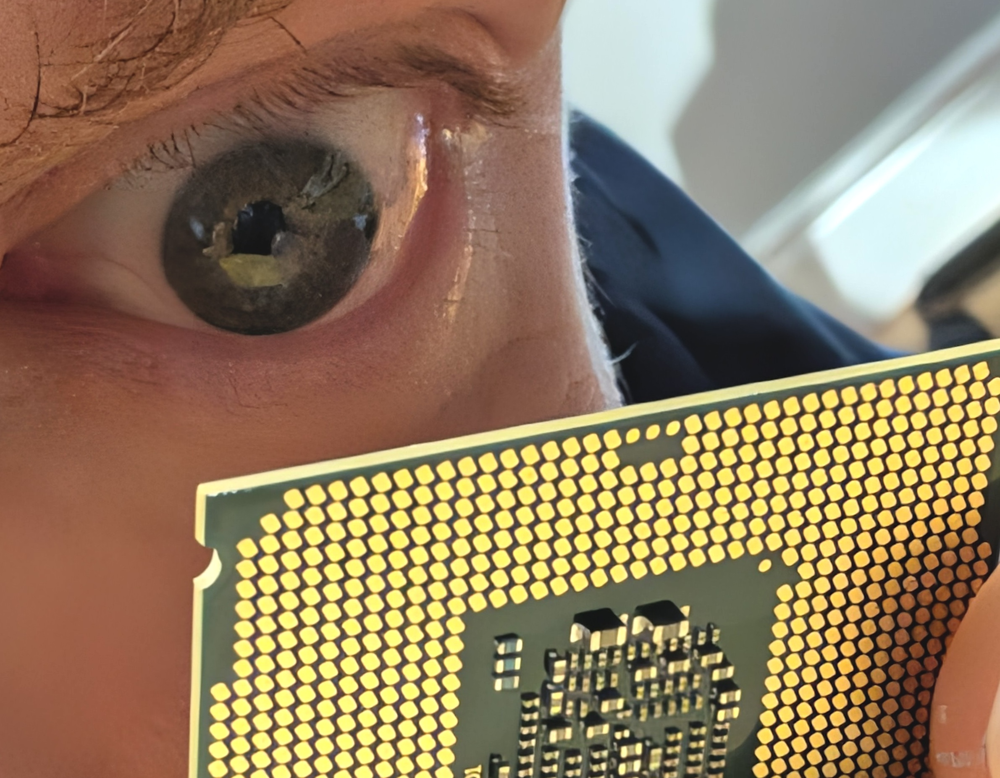

Yet another CPUID tool
===========================================

... but one made to demonstrate exercise C++26 Reflection features.

- The very point of this project is to have a declarative description
  of the CPUID fields **in one place only**, then use C++ reflection
  to find the names and position of those fields without help from
  macro stringification or other hacks.

- As of July 2025, compiler support for C++26 Reflection is limited to the
  [clang-p2996](https://github.com/bloomberg/clang-p2996/tree/p2996) by Blooomberg.
  - To compile this project, you have to roll your own clang-p2996 build locally
  - `Makefile` contains a hacky set of `CXX` and `CXXFLAGS` that work on my installation
  - **MAKE SURE YOU ADAPT** `CXX` and `CXXFLAGS` to your local clang installation details.

## References

- The latest paper on C++ Reflection at the time this project was started is:
  [P2996R12](https://www.open-std.org/jtc1/sc22/wg21/docs/papers/2025/p2996r12.html)

- CPUID return value interpretation is based on the
  [CPUID Wikipedia page](https://en.wikipedia.org/wiki/CPUID).
